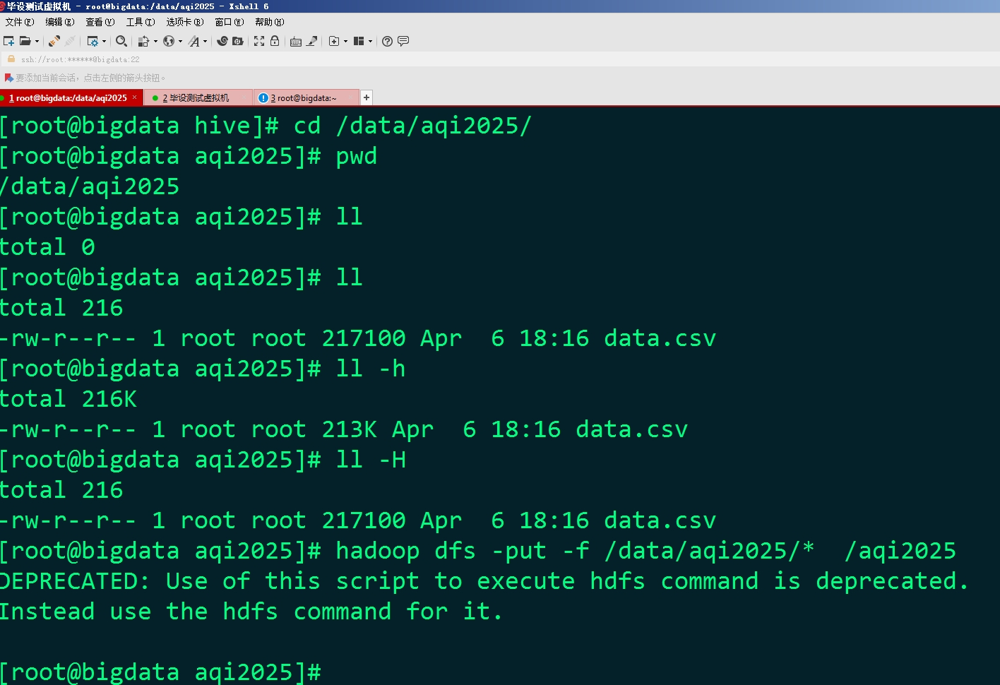

## 计算机毕业设计hadoop+spark+hive空气质量预测系统 空气质量大数据分析可视化 大数据毕业设计(源码+LW文档+PPT+讲解)


## 要求
### 源码有偿！一套(论文 PPT 源码+sql脚本+教程)

### 
### 加好友前帮忙start一下，并备注github有偿25空气质量预测系统
### 我的QQ号是2827724252或者798059319或者 1679232425或者微信:bysj2023nb

# 

### 加qq好友说明（被部分 网友整得心力交瘁）：
    1.加好友务必按照格式备注
    2.避免浪费各自的时间！
    3.当“客服”不容易，repo 主是体面人，不爆粗，性格好，文明人。

## 一、项目功能
```
1、数据采集与整合：从多个数据源（如空气质量监测站、气象部门、污染源企业等）采集空气质量相关数据，包括空气质量指标（如 PM2.5、PM10、SO₂、NO₂ 等）、气象数据（如温度、湿度、风速、风向等）和污染源数据（如工业排放、交通尾气等）。
2、对采集到的数据进行清洗和预处理，去除噪声和异常值，确保数据的准确性和可靠性。
3、数据分析与挖掘：对历史空气质量数据进行时间序列分析，了解空气质量的变化趋势和周期性规律。进行空间分析，绘制空气质量地图，展示不同地区的空气质量状况和污染分布情况。分析空气质量与气象条件、污染源等因素之间的关联关系，通过相关性分析、回归分析等方法，找出影响空气质量的关键因素。
4、空气质量预测：基于历史数据和分析结果，建立空气质量预测模型。可以采用机器学习算法或时间序列预测方法进行预测。
5、可视化展示：将空气质量数据和分析结果以直观的图表形式进行展示，如柱状图、折线图、地图等，方便用户理解和查看。提供实时空气质量监测数据的可视化展示，让用户随时了解当前的空气质量状况。
```


## 二、项目创新点
```
1、技术融合创新 结合 Spark 的高效分布式计算能力和 Hive 的数据仓库管理功能，实现对大规模空气质量数据的快速处理和存储。这种技术融合能够充分发挥两者的优势，提高数据处理效率和分析能力。
2、数据分析方法创新 采用多种数据分析方法，如时间序列分析、空间分析、关联分析等，全面深入地挖掘空气质量数据的潜在信息。例如，通过时间序列分析可以了解空气质量的变化趋势和周期性规律；空间分析可以展示不同地区的空气质量状况和污染分布情况；关联分析可以找出空气质量与其他因素之间的关系。
3、可视化创新 开发个性化的可视化界面，提供丰富多样的图表展示和交互功能。用户可以根据自己的需求选择不同的图表类型和分析维度，进行个性化的数据分析和展示。
```


## 三、开发技术介绍
```
编辑器：Pycharm
前端框架：HTML，CSS，JAVASCRIPT，Echarts
后端：Django
数据处理框架：Spark
数据存储：HIVE，MySQL
编程语言：Python
预测功能：线性回归
数据可视化：Echarts
```


## 演示视频
https://www.bilibili.com/video/BV1nVR6YZEj1/?spm_id_from=333.1387.homepage.video_card.click


## 运行截图





